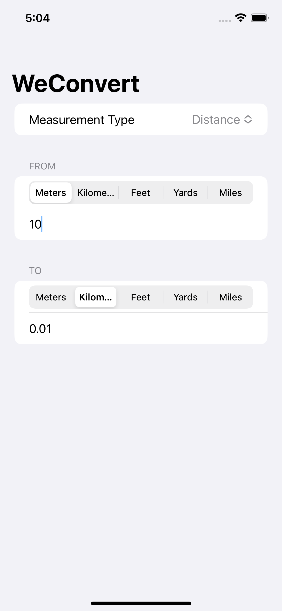

# Overview

This is my solution for the [Day 19 Challenge day of 100 days of SwiftUI](https://www.hackingwithswift.com/100/swiftui/19). I had prior knowledge of Swift's Measurement library and was excited to used it.  I'm happy with how this turned out, but could imaging refactoring the Convertor to be less code.

